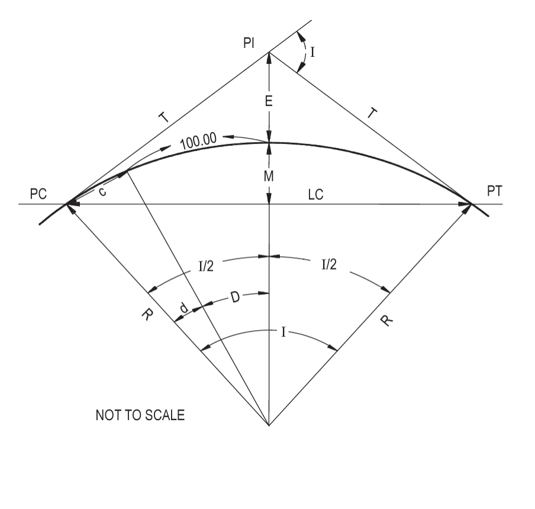

# Transportation Geometric Design Project

*This is my final project for *CE-UY 3013 Computing In Civil Engineering*.*
*It demostrates horizontal and vertical alignment procedures for highways and streets*
*according to AASHTO Design Guidelines.*

---

This program calculates the horizontal and vertical alignment of a roadway with a given starting point and other characteristics.
The program acts as road builder to determine where the end of the curve should be. All of the specifications can be found in **AASHTO A Policy on Geometric Design of Highways and Streets** most specifically Chapter 3 Elements of Design. This program is designed for U.S. customary units.

Assumptions:
* super elevation is equal to 0.10 which common use for highways with snow and ice cited in Section 3.3.3.2
* side friction factor is equal to 0.15 which is common for a 70 mph highway, this can vary greatly as it accounts for type of vehicle, condition of
roadway, and condition of tires
* one lane is traveling in each direction with no median (no case adjustment factor used)

Inputs:

*Horizontal Alignment*

* x and y coordinate of at startion point of curve
* speed (mph)
* tangent line length (ft)

*Vertical Alignment*

* x and z coordinate of at startion point of curve
* speed (mph)
* grades of back and forward tangents
* type of vertical curve (crest or sag)

Outputs:

*Horizontal Alignment*

* radius of curve
* intersection angle (I)
* point of tangent (PT)
* length of middle ordinate (M)
* external distance (E)
* length of long chord (LC)
* horizontal curve visualization



*Vertical Alignment*

* stopping sight distance
* length of curve
* vertical curve visualization


*Images from FE Reference Handbook*

## Setup

In order to use the program, you have to clone/download this repository,
navigate to the local directory and create a virtual environment with:

```
$ python3 -m venv venv
```

Then, activate the virtual environment:

```
For Linux/Mac OS:
$ source venv/bin/activate

For Windows:
> venv\Scripts\activate
```

Finally, install the required libraries for this program with:

```
$ pip install -r requirements.txt
```


## How to use the program


Here is how we can determine the horizontal and/or vertical alignment of a potential roadway.
Let's use a fictitious State Route 18 and determine the horizontal and vertical alignment with the given characteristics.

First instantiate a new object of ``Horizontal Alignment``:

*In this, we include the (x-coordinate, y-coordinate, speed, tangent length), all of which should be given.*

```python
>>> stateroute18h = HorizontalAlignment(2,5,60,3000)
```

Now, we can visualize the horizontal alignment:

```python
>>> stateroute18h.solve()
```

Let's try vertical alignment for the same State Route 18!

*In this, we include the (x-coordinate, y-coordinate, grade of back tangent, grade of forward tangent, speed, type of curve), all of which should be given.*

```python
>>> stateroute18v = VerticalAlignment(2,5,-0.5,0.2,60,'sag')
```

Now, we can visualize the vertical alignment:

```python
>>> stateroute18v.solve()
```

Lastly, we can gather other data. For example:

```python
>>> stateroute18h.radius()
```

*This gives us the radius of the horizontal curve.*

```python
>>> stateroute18v.curvecheck()
```

*This gives us the length of the vertical curve used for the alignment.*

**If there are any questions or concerns, please do not hesitate to reach out, hope you enjoy.** :)
